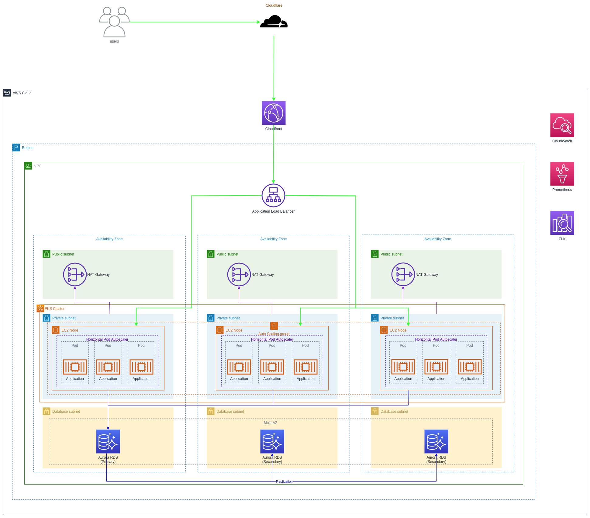

# test-hello

The application "Hello World" its a HTTP-base API.

This is a basic application developed using [Flask](https://palletsprojects.com/p/flask/) as web application framework and [SQLAlchemy](https://www.sqlalchemy.org/) as ORM.

## Prepare the environment

```
python3 -m venv .venv

# Activate
. .venv/bin/activate
```

Install dependencies manually
```
python3 -m pip install Flask
python3 -m pip install Flask-SQLAlchemy
python3 -m pip install flask_migrate
python3 -m pip install pytest
python3 -m pip install flask_testing
python3 -m pip install psycopg2-binary
```

Install dependencies using requirements
```
python3 -m pip install -r requirements.txt
```

## How to run the application locally
```
# database for testing
export DATABASE_URL="sqlite:///local.db"

# init database and migrations
python3 -m flask --app app db init
python3 -m flask --app app db migrate
python3 -m flask --app app db upgrade

# run application
python3 -m flask run --host=0.0.0.0 --port=8000
```


## How to run the application using docker and docker compose
```
docker compose -f docker-compose.dev.yml up --build
```


## How to run the tests
```
python3 -m pytest tests -v
```

## Build the application

This repository is configured to use [GitHub Actions](https://github.com/features/actions).
The workflows and actions are placed on [.github](./.github) folder.
For ever pull request created, the application tests are triggered.
And when pull request is merged, the application is built and pushed to the Github Docker registry ([here](https://github.com/users/cmar-apps-81/packages/container/package/test-hello))

The build of this application is describe in the script [buid.sh](./scripts/build.sh) and also here:
```
echo $CR_PAT | docker login ghcr.io --username _change_me_reponame_ --password-stdin

docker build --network host --force-rm -t test-hello:latest .

docker tag test-hello:latest ghcr.io/_change_me_reponame_/test-hello:v0.1.0
docker push ghcr.io/_change_me_reponame_/test-hello:v0.1.0

docker tag test-hello:latest ghcr.io/_change_me_reponame_/test-hello:v0.2.0
docker push ghcr.io/_change_me_reponame_/test-hello:v0.2.0
```

## How to deploy the application

To deploy the application to the cloud, we can use a kubernetes cluster.

There're different flavors of kubernetes cluster, but for AWS cloud, we can use a AWS managed version - [EKS](https://aws.amazon.com/eks/) - or a cloud agnostic version - [kOps](https://kops.sigs.k8s.io/).

Deploying the kubernetes cluster can be done using Terraform as Infrastructure as Code.
A draft version of the code to deploy a [EKS](https://aws.amazon.com/eks/) kubernetes cluster can be found in [terraform](./deploy/terraform/eks) folder.

After deploying kubernetes, the application can be deployed using the kubernetes deployments described in [deploy/kubernetes](./deploy/kubernetes) folder.

For production environment, the deployment of new version without downtime could be done using [blue-green or canary](https://circleci.com/blog/canary-vs-blue-green-downtime/) deployment.

The script [deploy_bluegreen.sh](./scripts/deploy_bluegreen.sh) describes the steps to run a blue-green deploy. 

Alternatively (or even to be used with [AWX](https://github.com/ansible/awx)), we can run a ansible playbook [bluegreen-deploy.yml](./deploy/ansible-playbooks/bluegreen-deploy.yml) to execute blue-green deploy as described in [deploy/ansible-playbooks](./deploy/ansible-playbooks/).

## System diagram for AWS cloud

